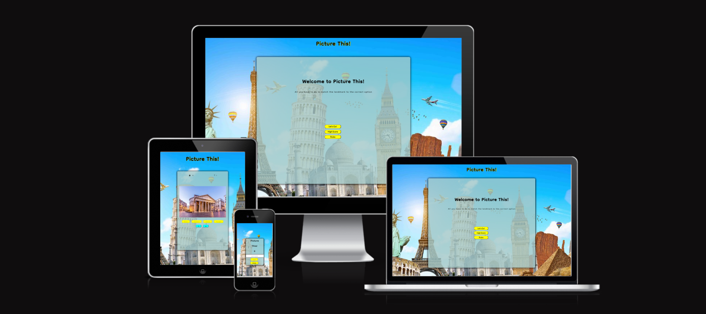
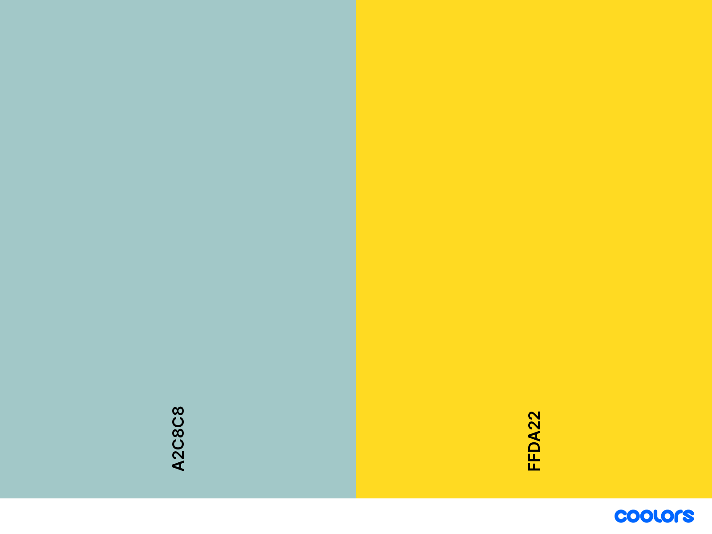
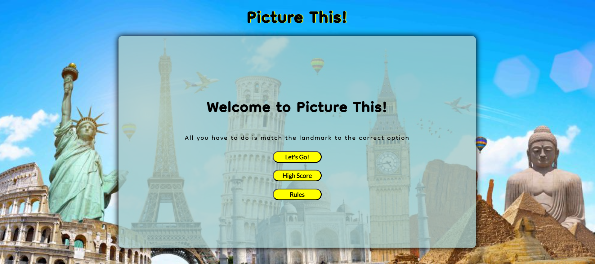
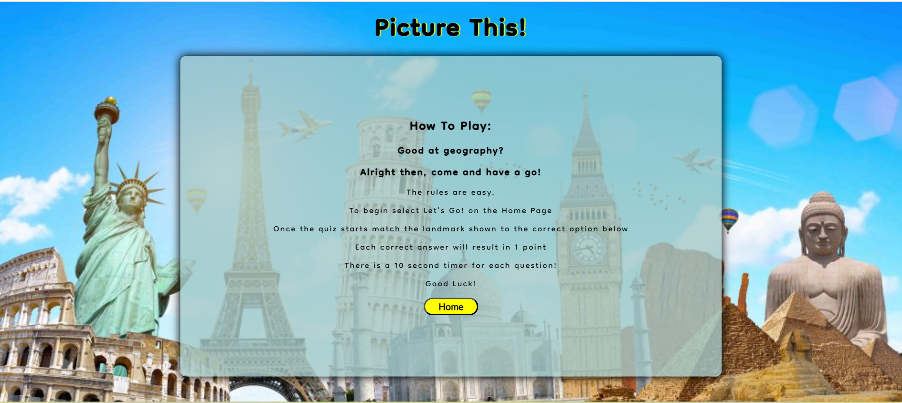
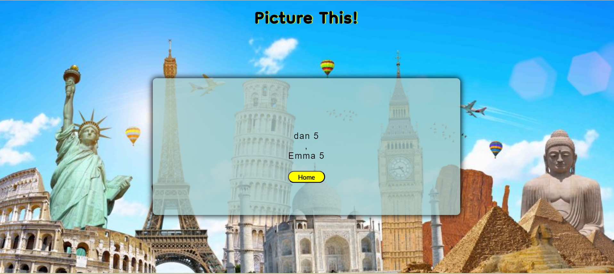
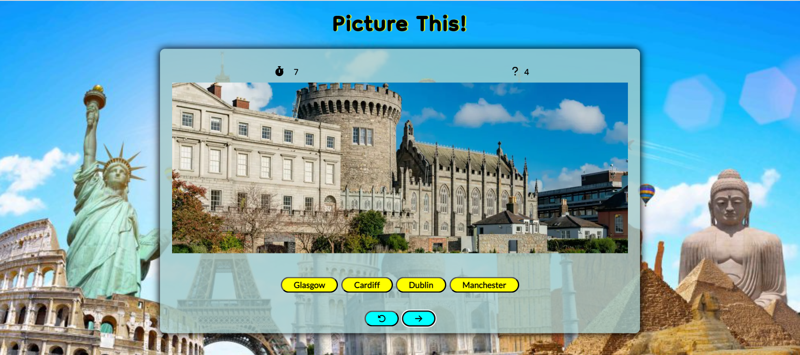
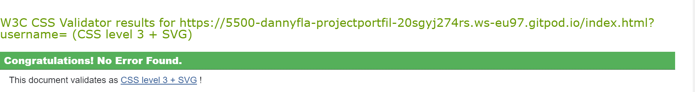
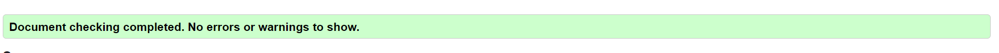
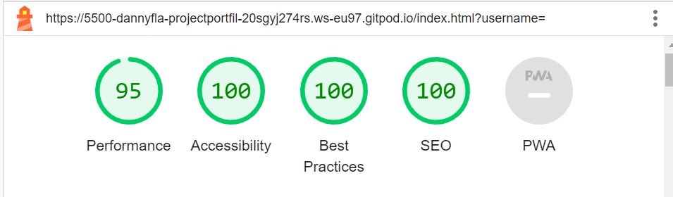

# Picture This! - Portfolio Project 2 - Javascript

Picture This! is an online quiz for users to test how well they know iconic landmarks from around the world.

Follow this link to check out the live site - <a href= "">

# Contents

- [Aims](<#Aims>)
- [User Experience](<#user-experience-ux>)
     - [Site Aims](<#site-aims>)
     - [User Stories](<#user-stories>)
     - [Design Wireframes](<#design-wireframes>)
     - [Design Choices](<#design-choices>)
        - [Colour Scheme](<#colour-scheme>)
        - [Typography](<#typography>)
- [Features](<#features>)
- [Future Features](<#future-features>)
- [Technologies Used](<#technologies-used>)
- [Testing](<#testing>)
    - [Code Validation](<#code-validation>)
    -  [JSHint](<#jshint>)
    - [Lighthouse Testing](<#lighthouse-testing>)
    - [Responsive Testing](<#responsive-testing>)
    - [Manual Testing](<#manual-testing>)
- [Deployment](<#deployment>)
- [Credits](<#credits>)
- [Acknowledgements](<#acknowledgements>)

# Objective

The purpose of this project is to provide the user with a quiz that is visually appealing, fully functional, respsonsive and engaging.

# User Experience (UX)

## Site Aims

- Present the user an engaging quiz to test their knowledge of iconic landmarks from around the world.
- Present the user a quiz that is both responsive and visually appealing on multiple devices.
- Provide the user with an option to save their scores and enter their own unique username.
- Present the user with a consistently interactive quiz that they can easily navigate.

| ID | ROLE | EXPECTATIONS | TARGET |
|-----------------|:-------------|:---------------:|:---------------:|
| 1 | USER | As I user I expect to be able to play Picture This! | To allow me to find out how well I know famous landmarks. |
| 2 | USER | As a user I expect to quickly understand the functionality of the quiz interface. | To allow me to enjoy my experience of playing Picture This!|
| 3 | USER | As a user I expect the site to be fully responsive. | To allow me to be able to play independant of location or device. |
| 4 | USER | As a user I expect the quiz to indicate whether I am correct or incorrect. | To allow me get instant feedback on my answers.  |
| 5 | USER | As a user I expect the quiz to track and save my score and username. | To allow me to improve my score and challenge my friends. |

## Design Wireframes

View wireframes here: 

[WireFrame Home Page](assets/images/wrieframe-home.png)

[WireFrame Quiz Page](assets/images/wireframe-quiz.png)

[WireFrame Responsive Home Page Tablet](assets/images/wireframe-responsive.png)

[WireFrame Responsive Home Page Mobile](assets/images/wireframe-responsive-2.png)

## Design Choices

### Colour Scheme

Picture This! uses a complementary colour harmony. The quiz container contains a lighter shade of blue than the darker blue used in the background image. This is to sublty draw the user's attention to the crux of the game without taking away the background imagery. Yellow on the other hand is directly opposite from blue and its purpose is to pronounce the game's buttons.

### Typography

The font used for Picture This! was Dongle. It was chosen for its rounded frame that projects a playful and rhythmic visual for the user.

# Features

### Home Page

 - The home page will be displayed to the user once they open the website.
 - The user will be shown the Picture This! title a navigation bar, a short description and three buttons.
 - The three buttons provide the user with the options to:
    - Begin the quiz.
    - View the game's leaderboard.
    - Open the quiz rules.

    

### Rules Page

- This page contains the rules on how to play the quiz and what is expected of the user.
- A "Home" button is included to take the user back to the "Home Page".

### High Scores Page

- This page will display the user's name and their top five highest scores if already saved to the site's local storage.
- A "Home" button is included to take the user back to the "Home Page".

### Quiz Page

- The page will display to the user: 
    - Picture This! heading.
    - An image of a famous landmark.
    - Four possible option buttons.
    - Next and restart buttons.
    - A navigation bar that includes a home icon, quiz timer, question counter and a volume icon.

- The home icon will redirect the user back to the "Home Screen".
- The timer will start once the quiz begins. If timer gets to zero before an option is selected it will disable all option buttons.
- The question counter will increment by one as the user progresses through the quiz.
- The volume will either play or mute the quiz music depending on the user's preference.
- The option buttons will turn green if selected correctly and red if selected incorrectly. They will also disable once an option has been selected to prevent multiple options being chosen.
- The next button will progress the user on to the next stage of the quiz.
- The restart button will reset the quiz and revert the score, timer and counter back to its original state.

### Quiz Completion Page

- The user will be directed to this section once they have navigated their way through ten questions.
- Here the user will be given their final score and an input box.
- They can chose to enter their name into the input to be viewed on the leaderboard.

# Future Features

## Quiz Difficulty Level

- This could be achieved by including an extra page before the user begins the quiz, where they would be presented with the opportunity to choose the level of difficluty e.g. easy, medium, hard.
- A way to increase the quiz difficulty is to adjust the length of time the user has to make a decision for each question.

# Technologies Used
- HTML5
- CSS3
- Javascript
- Balsamiq
- Google Chrome DevTools
- GitHub
- GitPod

# Testing

## Code Validation

Picutre This! was validated using W3C HTML validator and W3C CSS validator.

## JSHint

Javascript was validated using JSHint.

## Lighthouse Testing

Chrome DevTools' Lightjouse was used to test the site's performance, accessibility, best practices and SEO.

## Responsive Testing

Picture This was tested across different devices and also by using The Responsive Design Checker website.

## Manual Testing

- Home Page

    - Confirmed that the "Let's Go!" button will start the quiz.
    - Confirmed that the "High Scores" button will take the user to the leaderboard.
    - Confirmed that the "Rule" button will take the user to the quiz rules page.

- Quiz Page 

    - Confirmed that the quiz generates a question at the beginning of the quiz and when the user moves onto the next question.
    - Confirmed that the option button turns green if corect and red if incorrect.
    - Confirmed that the timer will begin its countdown at the beginning of the quiz and will restart when the user moves on to the next question.
    - Confirmed that the timer will stop it countdown at zero and disable the option buttons.
    - Confirmed that the question counter will incremement by one for each question asked.

- Quiz Completion Page

    - Confirmed that the page will appear when the user completes the quiz.
    - Confirmed that the user can enter their name into the input box.
    - Confirmed that the user's score will be displayed.
    - Confirmed that the "Save" button will no longer be disabled once a valid input is entered.

- High Scores Page

    - Confirmed that the user's name and score will be displayed here.
    - Confirmed that only the top five scores will be displayed.
    - Confirmed that the home button will redirect the user to the "Home Page".

- Rules Page 
     
     - Confirmed that the rules of the quiz will be displayed here.
     - Confirmed that the home button will redirect the user to the "Home Page".

# Deployment 

Picture This! was deployed to GitHub pages The steps to deploy are: 
    
- In the GitHub repository select Settings.
- Select the source tab, the select the branch titled "Main" and in the dropdown menu select the folder titled "Root".
- Select "Save".

# Credits

- Background image was obtained from [fact.net](https://facts.net/)
- Button styling was inspired from [fdossena.com](https://fdossena.com/?p=html5cool/buttons/i.frag)
- Images used for quiz questions were obtained from various Google images soucres.
- Timer was inspired from [stackoverflow.com](https://stackoverflow.com/questions/4435776/      simple-clock-that-counts-down-from-30-seconds-and-executes-a-function-afterward)
- 
- Idea to store and retrive information from browser cookies came from my friend Conor.
- Timer and Countdown functions were inspired from Code Instuite's Slack community.

# Acknowledgements

I would like to thank my mentor, Code Instuite's Tutor Support, members of the Slack community for all their help and support throughout the creation of the site.

# Bugs

- Restart Quiz function, doesn't restart on first question. messes up timer.
- Rules home button doesn't work.